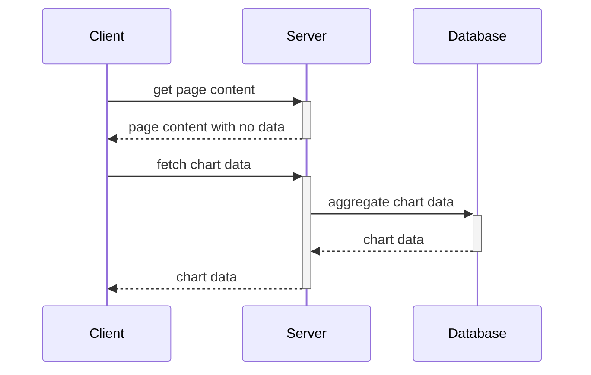

<p align="center">
  
</p>

<h1 align="center">a slice of pi</h1>

[](.github/workflows/ci.yml)
[](LICENSE)

**a slice of pi** is a web app created for the [OutStem Coding Challenge](https://github.com/AES-Outreach/Summer-2024-Coop-Interviews) that allows users
to view charts about various statistics aggregated from the fictional pizza place of the same name.

## Tools

- [Svelte](https://svelte.dev/) for reactivity and components
- [SvelteKit](https://kit.svelte.dev/) for routing and SSR
- [tRPC](https://trpc.io/) for API
- [Redoc](https://redoc.ly/) + [OpenAPI](https://swagger.io/specification/) for API documentation
- [Chart.js](https://chartjs.org/) for charts
- [Tailwind CSS](https://tailwindcss.com/) for styling
- [Bits UI](https://www.bits-ui.com/) for components
- [PostgreSQL](https://www.postgresql.org/) for database
- [Drizzle](https://orm.drizzle.team/) + [Drizzle Kit](https://orm.drizzle.team/kit-docs) for database ORM and migrations
- [Cloudflare Tunnels](https://www.cloudflare.com/products/tunnel/) for deployment

## Bonus

- [x] API documentation
- [x] Chart and page animations
- [x] Nice header and cohesive design

## Major Parts

- [**src/lib/server/db**](src/lib/server/db) - database utilities and Drizzle schema
- [**src/lib/server/routes**](src/lib/server/routes) - API endpoints
- [**drizzle**](drizzle) - database migrations
- [**src/routes**](src/routes) - SvelteKit routes
- [**src/lib/components**](src/lib/components) - components
- [**src/lib/components/bits**](src/lib/components/bits) - components from Bits UI

## Website sequence diagram



## Development

### Prerequisites

- [Node.js](https://nodejs.org/en/)
- [PostgreSQL](https://www.postgresql.org/)

### Setup

```bash
# install dependencies
pnpm install

# start the development server
pnpm dev

# load in data (one-time)
pnpm load-data
```

### Environment Variables

See the [`.env.example`](.env.example) file for a list of environment variables that need to be set.

## Deployment

```bash
# build for production
pnpm build

# start the server
pm2 start ecosystem.config.cjs
```
